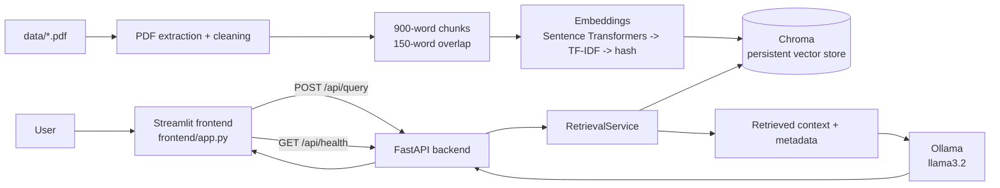
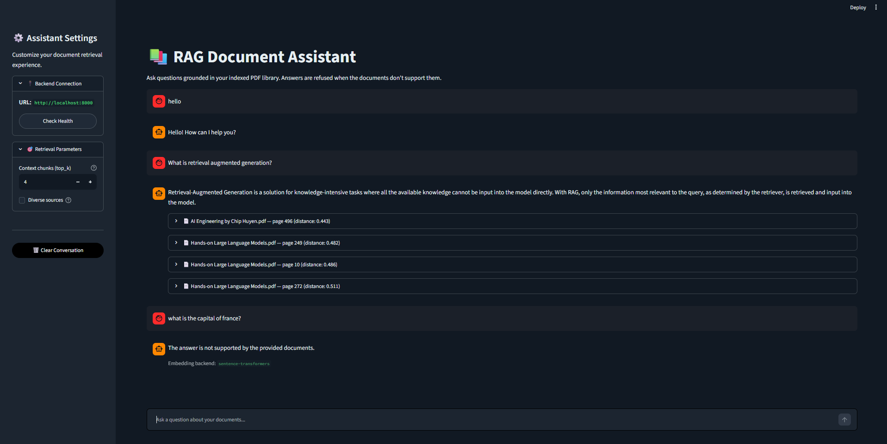

# RAG-Powered Document Assistant

A local retrieval-augmented generation (RAG) application for asking questions about a curated PDF library. The system extracts and chunks PDF text, retrieves relevant passages, and uses a local Ollama model to produce citation-oriented answers. Unsupported questions are refused instead of being answered from outside knowledge.

## Overview

The project has two user-facing pieces:

- **FastAPI backend**: builds or loads the retrieval index, exposes query and health endpoints, and generates grounded answers.
- **Streamlit frontend**: provides a chat interface, backend health check, retrieval controls, conversation history, and expandable source citations.

The backend reads PDF files from `data/` and persists its cache and Chroma data under `backend/data/vector_store/`.

## Architecture



## Tech Stack

| Layer | Technology |
| --- | --- |
| API | Python, FastAPI, Uvicorn, Pydantic |
| Document processing | `pypdf`, regular-expression cleaning, word-based chunking |
| Retrieval | ChromaDB, Sentence Transformers, scikit-learn TF-IDF fallback, hash fallback |
| Generation | Ollama with the `llama3.2` model |
| UI | Streamlit |
| Validation | pytest and FastAPI `TestClient` |

## Project Structure

```text
rag-assistant-project/
├── backend/
│   ├── app/
│   │   ├── api/routes/query.py       # /api/query and /api/health
│   │   ├── core/config.py            # paths and model settings
│   │   ├── schemas/query.py          # request/response models
│   │   └── services/
│   │       ├── retrieval.py          # extraction, indexing, retrieval
│   │       └── generation.py         # prompt construction and Ollama calls
│   ├── data/vector_store/            # generated Chroma data and cache
│   ├── tests/test_query.py
│   └── requirements.txt
├── data/                             # source PDF library
├── frontend/
│   ├── app.py                         # Streamlit application
│   ├── api_client.py                  # backend HTTP client
│   └── requirements.txt
├── notebooks/rag_pipeline.ipynb       # exploratory pipeline and evaluation
└── README.md
```

## Domain and Data

The indexed domain is machine learning and generative AI engineering. The current library contains seven PDFs covering AI engineering, data preprocessing, deep learning, machine-learning systems, large language models, and practical machine learning.

At startup, the backend:

1. Finds every `*.pdf` in `data/`.
2. Extracts text page by page and preserves source filename and page number.
3. Cleans whitespace and hyphenated line breaks.
4. Creates 900-word chunks with 150 words of overlap.
5. Embeds chunks using the first available backend: Sentence Transformers, TF-IDF, or hashed token vectors.
6. Stores the resulting index in Chroma and a local pickle cache.

The captured notebook run produced **6,651 chunks** from the seven PDFs. In that run, Sentence Transformers was unavailable because of a local Windows DLL policy, so the pipeline used **TF-IDF** embeddings and created the `rag_documents_tfidf` Chroma collection.

## Obtaining the Document Corpus

The PDF library is not included in the repository due to size constraints. To run the application, you must obtain or prepare your own document collection:

**Option 1: Use the reference library** (private access)
Contact the repository maintainer to access the reference set of seven AI/ML engineering books.

**Option 2: Use your own PDFs**
Place any PDF files in the `data/` directory:
```
data/
  your-document-1.pdf
  your-document-2.pdf
  ...
```

The backend will automatically extract, index, and embed all PDFs found in `data/` on startup.

## Setup

### Prerequisites

- Python 3.10 or newer
- Ollama installed and running locally for generated answers
- The `llama3.2` model downloaded with `ollama pull llama3.2`
- PDF files in the `data/` directory (see "Obtaining the Document Corpus" above)

### Backend

From the repository root:

```powershell
cd backend
python -m venv .venv
.\.venv\Scripts\Activate.ps1
python -m pip install -r requirements.txt
uvicorn app.main:app --reload
```

The API is then available at `http://localhost:8000`. The first startup may take time while PDFs are extracted, embedded, and indexed. Later starts can reuse `backend/data/vector_store/retrieval_cache.pkl`.

### Frontend

Open a second terminal from the repository root:

```powershell
cd frontend
python -m venv .venv
.\.venv\Scripts\Activate.ps1
python -m pip install -r requirements.txt
$env:API_BASE_URL = "http://localhost:8000"
streamlit run app.py
```

Open the URL printed by Streamlit, normally `http://localhost:8501`.

## Environment Variables

All backend settings have code defaults. Backend variables are read by Pydantic Settings; frontend configuration uses `API_BASE_URL`.

| Variable | Default | Used by | Description |
| --- | --- | --- | --- |
| `API_BASE_URL` | `http://localhost:8000` | Frontend | FastAPI base URL |
| `EMBEDDING_MODEL` | `all-MiniLM-L6-v2` | Backend | Sentence Transformers model name |
| `OLLAMA_MODEL` | `llama3.2` | Backend | Local Ollama generation model |
| `CHUNK_SIZE` | `900` | Backend | Chunk size in words |
| `CHUNK_OVERLAP` | `150` | Backend | Overlap between adjacent chunks |
| `TOP_K` | `4` | Backend | Default number of retrieved chunks |
| `MAX_DISTANCE_SENTENCE_TRANSFORMERS` | `0.55` | Backend | Retrieval distance threshold for Sentence Transformers |
| `MAX_DISTANCE_FALLBACK` | `0.99` | Backend | Retrieval distance threshold for fallback embeddings |

For example, a frontend `.env` file can contain:

```dotenv
API_BASE_URL=http://localhost:8000
```

## API Reference

### `GET /`

Returns a basic service status:

```json
{"service":"RAG Document Assistant","status":"running"}
```

### `GET /api/health`

Returns index and dependency status:

```json
{
	"status": "ok",
	"chunks_indexed": 6651,
	"embedding_backend": "tfidf",
	"ollama_available": true
}
```

### `POST /api/query`

Request body:

| Field | Type | Required | Description |
| --- | --- | --- | --- |
| `question` | string | Yes | Question about the indexed documents |
| `top_k` | integer, 1-20 | No | Override the number of retrieved chunks |
| `diverse_sources` | boolean | No | Return at most one chunk per source file |

Example:

```bash
curl -X POST http://localhost:8000/api/query \
	-H "Content-Type: application/json" \
	-d '{"question":"What is retrieval augmented generation?","top_k":4,"diverse_sources":true}'
```

The response includes the question, generated answer, embedding backend, and source objects containing `source`, `page`, `chunk`, `distance`, and retrieved text.

### Retrieval behavior

Specific questions are filtered by the configured embedding-distance threshold. Document-overview questions, such as `What is the main topic of these documents?`, `What is the main objective of these documents?`, and summary requests, use the best representative chunks after the normal text-quality filters. This ensures broad questions receive document context while unsupported specific questions can still be refused.

## Evaluation Results: Phase 2.6

The Phase 2.6 evaluation is captured in `notebooks/rag_pipeline.ipynb` and consists of **10 questions** spanning RAG, preprocessing, reliability, embeddings, transformers, training versus inference, vector databases, model degradation, project evaluation, and model limitations.

| Measure | Captured result |
| --- | --- |
| Evaluation questions | 10 |
| Retrieved chunks per question | 4 for each row in the captured table |
| Embedding backend | TF-IDF fallback |
| Indexed chunks | 6,651 |
| Chroma collection | `rag_documents_tfidf` |
| Grounding behavior | Supported answers include document/page citations; unsupported prompts return a refusal |

Qualitatively, the run retrieved relevant sources for supported questions such as RAG, embeddings, transformers, and vector databases. It also demonstrated refusal behavior for prompts whose answers were not directly supported by the retrieved context. The notebook does not record a labeled accuracy score, precision/recall value, or pass/fail ground-truth column, so no numeric accuracy is claimed here.

## Screenshots

The following screenshot was captured from the running Streamlit app at `http://localhost:8501` with the retrieval controls and suggested questions visible:



The screenshot was captured from the running local UI. To reproduce it locally, start the backend and frontend using the commands above. The app shows the backend connection URL, a health-check action, the `top_k` slider, the diverse-sources option, suggested questions, and a chat input.

## Tests

Run the backend test suite from the `backend/` directory:

```powershell
python -m pytest
```

The test suite covers the FastAPI health endpoint, relevant and irrelevant questions, empty questions, and invalid request bodies.
